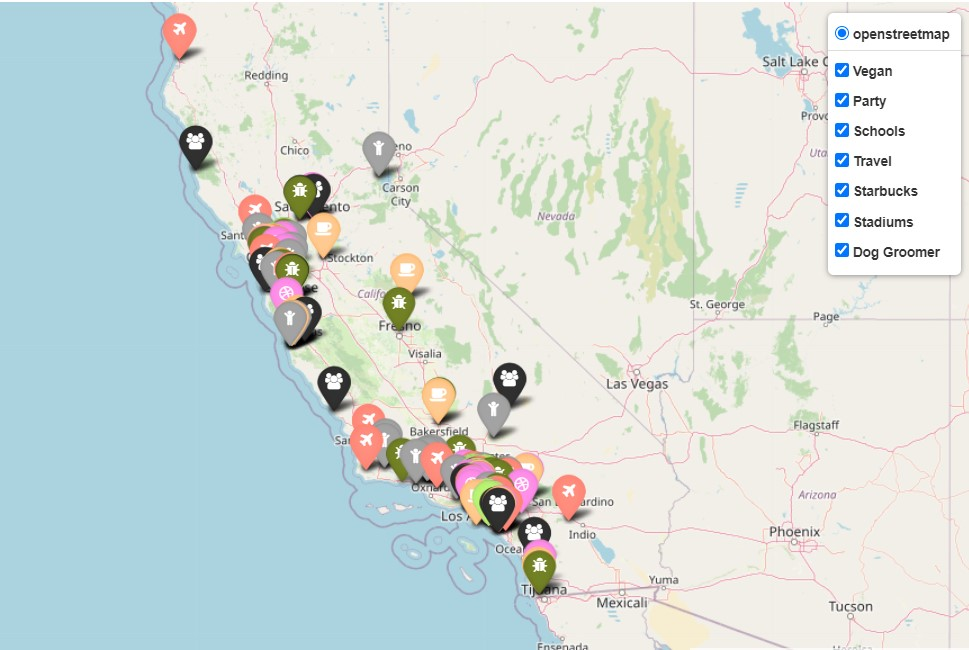
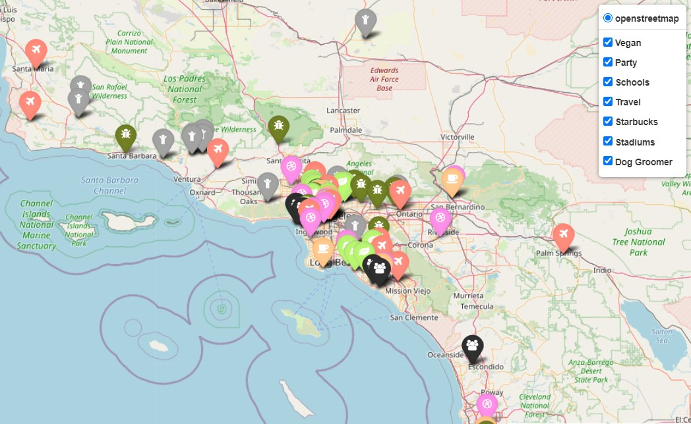
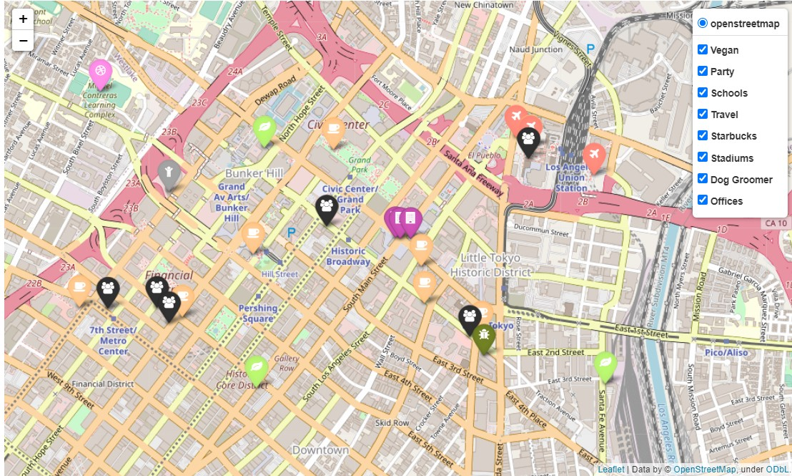

# GeoSpatial-Data-Project
The aim of this project is to find the perfect place to locate our recently created gaming company. The possible locations for the company are the locations of the offices in [this file](https://data.crunchbase.com/docs). However, we already know that it will be located in the United States of America because they are financing our start up.

We care a lot about our employees happiness, for this reason we asked them what are their interests and hobbies so we can locate the office in a location where they can satify such interests.

After they told us their preferences, we put them in a table that can be found under the *"Employees interests in a 0-10 rank"*.

___

## Employess interests in a 0-10 rank:
In this table. the **importance** field has been filled considering that if our goal is that the company grows, the CEO preference is the most important one since she/he should be happy and comfortable. The maintenance guy and the dog preferences are the less important from the perspective of the company growth. 

The number of people that share a same preference has also been taking into consideration, as well as if the interest is more a preference (go party) or a neccesity (need a school for the kids).

There is a total of 87 employees.

| Employee           | Preference                                       |Importance| 
|---                 |---                                               |---       |
|20 Designers        | Design talks. Nearby design companies.           |    5      | 
|5 UI/UX Engineers   |                                                  |          |  
|15 Developers       | Be near startups that have raised at least 1M $. |     5     |  
|15 Data Engineers   |                                                  |          |  
|20 Account Managers | Need to travel. Airport, bus/train station.      |     8    |  
|1 Maintenance       | Like basketball, stadium in 10km radius.         |     1   |  
|10 Executives       | Like Starbucks.                                  |     7    |   
|1 CEO/President     | Vegan bars and restaurants.                      |     10   |
|                    | COMMOM PREFERENCES BELOW                         |          |
|26 people           | Have kids. Kindergarten. School.                 |     9    |
|87 people           | Place to party.                                  |     10   |
|Pepe the dog        | Hairdresser. Dog groomer.                        |     1   |

That said, let's start working with the preferences that have been ranked the higuest.

## Preferences locations:
From the 18801 documents in the dataset, only 10834 tell us the office location. 7600 of those 10834 locations are in the US, and more specifically, 2924 offices are located in California. Also, the majority of the gaming companies in the US are located in California.

For this reason the zone that we will study is  California.

After placing somes of these preferences on a map, this is the obtained result. As we can see, the best locations for our office are either San Francisco or Los Angeles. However, there are more vegan restaurants in Los Angeles, and since the vegan employees are the CEO and I, we will move to Los Angeles.
#### California map:

#### Los Angeles map:

## Choosen offices:
There are 3 offices that are suitable for us, which means that thet have:
- A vegan restaurant closer than 1km
- A pub closer than 1km
- A school closer than 5km
- Access to travel closer than 2km
- A starbuck closer than 300m
- A stadium closer than 2km
- A dog groomer closer than 1km

However, these offices are really close. Close to the addreess:

106-100 W 1st St Los Angeles, CA 90012 EE. UU.

_______

The functions used for this projects can be found in scr.functions. The rest of the files in src help you understand better the functions.